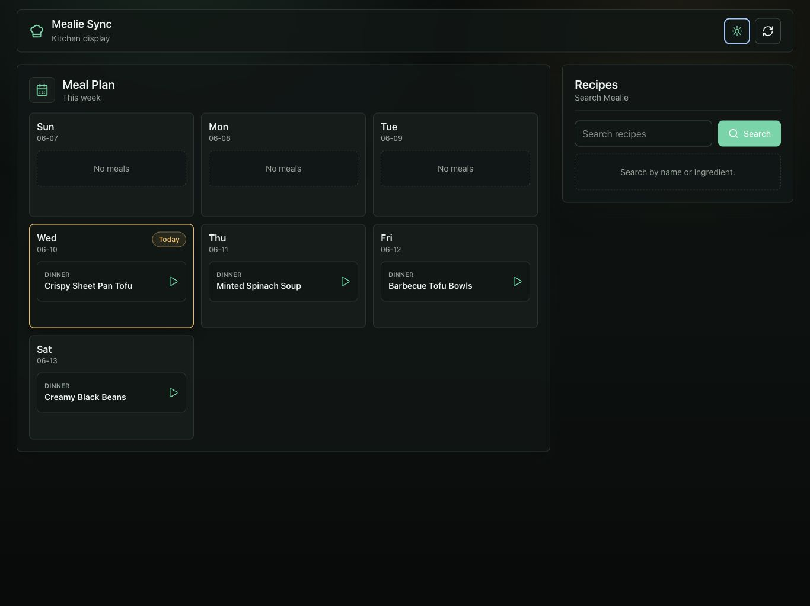
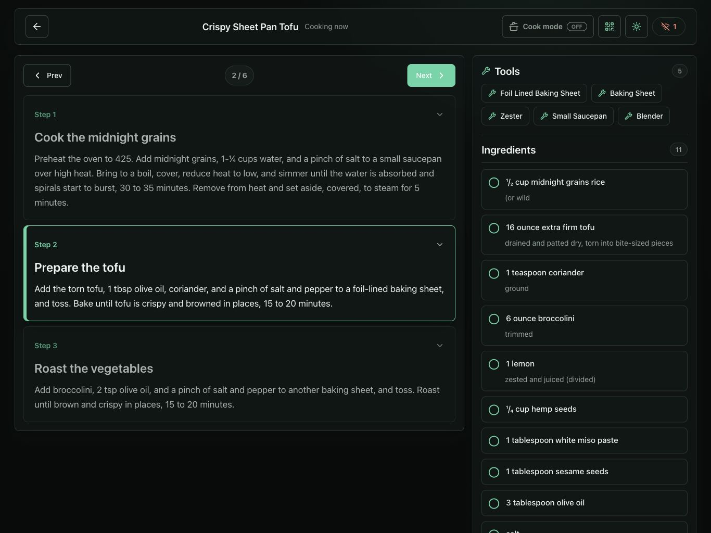

# Mealie Chef 

LAN-hosted synchronized Mealie cooking display for iPads. The app reads meal
plans and recipes from Mealie, starts a shared cooking session, and keeps joined
screens on the same recipe step with synced ingredient checkoffs.

## Features

- Weekly planner from Mealie, with an app-configured `Today` date.
- Recipe search against Mealie.
- Shared `/session` cooking screen for one or more iPads.
- WebSocket sync for the active step, ingredient checkoffs, presence, and
  reconnects.
- Persistent SQLite session state, including historical sessions and ingredient
  progress.
- Cook mode using the browser Screen Wake Lock API when available.
  - Must be run in an HTTPS context
- Light and dark themes.
- `/import` flow for URL, pasted-text, and multi-screenshot recipe imports with
  an editable review before anything is written to Mealie.

## Screenshots





## Stack

- React 19, Vite, and Tailwind CSS for the iPad UI.
- Fastify for the API, static file serving, and WebSockets.
- Node's built-in `node:sqlite` API for local persistence.
- `pnpm` for package management, `xo` for linting, and `vitest` for tests.
- Docker image based on Node 24.

## Quick Start

Requirements:

- Node.js 24 LTS or another supported Node release. The Docker image uses
  `node:24-alpine`.
- pnpm 10.x. This repo pins `pnpm@10.29.3` in `package.json`.
- A reachable Mealie instance and API token.
- An OpenAI API key when using the recipe importer.

Install dependencies and create local config:

```sh
pnpm install
cp .env.example .env
```

Edit `.env` with your Mealie URL, token, and optional OpenAI importer settings,
then start development mode:

```sh
pnpm dev
```

Development mode serves the Vite client at `http://localhost:5173` and the
Fastify API at `http://localhost:3100`.

For actual iPad testing on the LAN, build the client and serve everything from
Fastify so the browser uses the same origin for HTTP and WebSockets:

```sh
pnpm build
pnpm start
```

Then open `http://<your-mac-lan-ip>:3100` on the iPads.

## Common Commands

```sh
pnpm dev          # Run Vite and the Fastify server in watch mode
pnpm build        # Build client and server into dist/
pnpm start        # Run the production server from dist/
pnpm test         # Run Vitest once
pnpm test:watch   # Run Vitest in watch mode
pnpm lint         # Run XO
pnpm typecheck    # Type-check client and server configs
```

## How It Works

The planner page at `/` fetches the current Mealie week and lets you start a
recipe from the planner or recipe search. The `Import recipe` action opens
`/import`, where a URL, pasted text, or up to eight screenshots are parsed by
OpenAI and shown in an editable preview before confirmation.

The importer API is intentionally scoped to `/import/parse` and
`/import/confirm`, so a reverse proxy or Cloudflare Access policy can protect
the whole `/import/*` path. `OPENAI_API_KEY` and `MEALIE_API_TOKEN` never reach
the browser. Parsed drafts remain in the browser until the user confirms the
Mealie write. At confirmation, the final ingredient text is sent through
Mealie's ingredient parser, which can resolve existing foods, units, and
aliases before the structured ingredients are saved. Only lines Mealie cannot
map may receive one batched LLM cleanup pass; the normalized lines go back
through Mealie before any missing food or unit is created.

Every iPad on `/session` joins the current global session. Step changes and
ingredient checkoffs are written to SQLite and broadcast over WebSockets. If a
socket drops, the client reconnects and receives the latest snapshot.

The current shared session is a pointer stored in SQLite `app_state`. The
underlying `sessions` and `ingredient_checks` rows are kept as history. The
`SESSION_MAX_AGE_HOURS` setting only expires the current global-session pointer
when the session has not been updated recently.

## Documentation

See [docs/SETUP.md](docs/SETUP.md) for full setup, configuration, deployment,
persistence, and troubleshooting notes.

## Security

This app has no built-in user authentication. Run it on a trusted LAN or behind
access controls; protect `/import/*` especially because it can invoke OpenAI
and Mealie writes. Keep `MEALIE_API_TOKEN` and `OPENAI_API_KEY` in environment
variables or local `.env` files, never in committed files.
